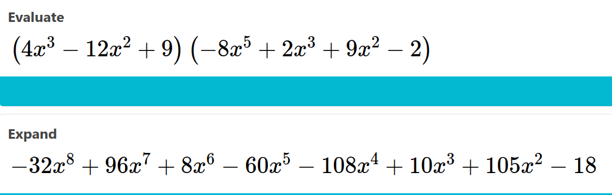

**Arshak Parsa**

# Polynomial multiplication

Define a structure
```cpp
#include <iostream>

using namespace std;

#define MAX_TERMS 101

typedef struct {
	float coef;
	int expon;
} poly;

poly terms[MAX_TERMS];
int avail = 0;
```
Attach function same as the book
```cpp
void attach(float c,int e){
	if (avail >= MAX_TERMS){
		cout << "Too many terms!";
		exit(1);
	}
	terms[avail].coef = c;
	terms[avail++].expon = e;
}
```
A function for printing
```cpp
void print(int start, int finish){
	cout << " ";
	for (int i=start;i<=finish;i++){
		if (i!=start && terms[i].coef>0)
			cout << "+";
		cout << terms[i].coef;
		if (terms[i].expon != 0)
			cout << "x^" << terms[i].expon ;	
	}		
	cout << endl;						 
}
```
Now we write the multiplication function.
```cpp
void mul(int sA,int fA,int sB,int fB,int *sC,int *fC){
	*sC=avail;
	// We assume that the polynomials are
    // sorted by expon
	// Make a temporary array:
	int n = terms[sA].expon+terms[sB].expon+1;
	float temp[n];
	for (int i=0;i<n;i++) 
		temp[i] = 0;
	for (int i=sA;i<=fA;i++){
		for (int j=sB;j<=fB;j++){
		    temp[terms[i].expon+terms[j].expon]+=
            terms[i].coef*terms[j].coef;							
		}
	}
	for (int i=n-1;i>=0;i--) {
		if (temp[i]!=0)
			attach(temp[i],i);
	}
	*fC=avail-1;
}
```
If $fA-sA=A$ and $fB-sB=B$ then the time complexity would be 
`O(n+A*B)`.

Here is an example
```cpp
int main()
{
	//poly A
	attach(4,3);
	attach(-12,2);
	attach(9,0);
	int startA = 0;
	int finishA = 2;
	cout << " polynomial A is: \n";
	print(startA,finishA);
	//poly B
	attach(-8,5);
	attach(2,3);
	attach(9,2);
	attach(-2,0);
	int startB = 3;
	int finishB = 6;
	cout << " polynomial B is: \n";
	print(startB,finishB);
	
	int sC,fC;
	mul(startA,finishA,startB,finishB,&sC,&fC);
	cout << " startC = " << sC << " , finishC = " << fC << endl;
	print(sC,fC);
}
```
result
```text
 polynomial A is: 
 4x^3-12x^2+9
 polynomial B is: 
 -8x^5+2x^3+9x^2-2
 startC = 7 , finishC = 14
 -32x^8+96x^7+8x^6-60x^5-108x^4+10x^3+105x^2-18
```
solution of Math solver :

