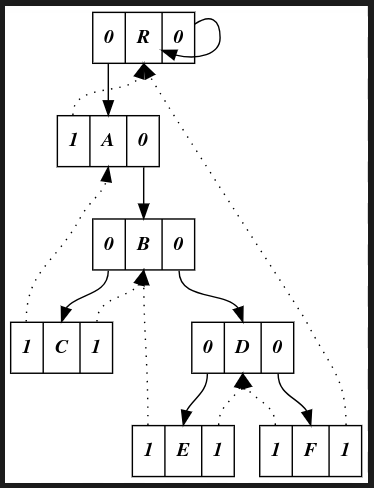
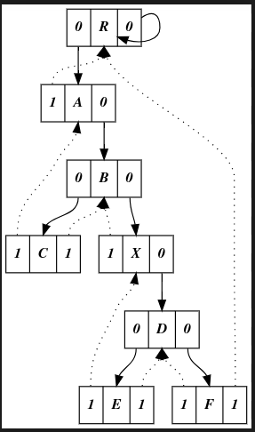

Arshak Parsa

Define a structure
```cpp
#include <iostream>
using namespace std;

typedef struct ttree *tp;
typedef struct ttree{
	bool lt;
	tp left_child;
	char data;
	bool rt;
	tp right_child;
	ttree(char dt) : data(dt), lt(true), rt(true){}
};

tp root= new ttree('R');
```
A function for printing in DOT language (graphviz)
```cpp
void printNode(tp node){
	cout << " " << node->data << " [label=\"<l> " << node->lt<<"|<m>"<< node->data <<"|<r> "<< node->rt <<"\"]; " << endl;
	if (node->left_child!=NULL){						
		cout <<" "<< node->data << ":l" << " -> " << node->left_child->data << ":m";							
		if (node->lt){
			cout << " [style=dotted]" << endl;
		}else{		
			cout <<endl;				
			if (node != node->left_child)
				printNode(node->left_child);
		}
	}
	if (node->right_child!=NULL){						
		cout <<" " << node->data << ":r" << " -> " << node->right_child->data<<":m";							
		if (node->rt){
			cout << " [style=dotted]" << endl;
		}else{		
			cout <<endl;				
			if (node != node->right_child)
				printNode(node->right_child);
		}
	}
}
void printTTree(tp root){
	cout << "digraph Gr {" << endl;
	cout << "node [shape=record];" << endl;
	printNode(root);
	cout << "}" << endl;
}

```
insucc & inprev according to the book (We will need these later)
```cpp

tp insucc(tp tree){
	tp temp = tree->right_child;
	if (!tree->rt)
		while(!temp->lt)
			temp = temp->left_child;
	return temp;
}

tp inprev(tp tree){
	tp temp = tree->left_child;
	if (!tree->lt)
		while(!temp->rt)
			temp = temp->right_child;
	return temp;
}
```
Two functions for inserting only
```cpp
tp insert_new_left(tp node,char data){
	tp temp = new ttree(data);
	temp->left_child = node->left_child;
	temp->right_child = node;
	temp->lt=node->lt;
	
	node->lt =false;
	node->left_child=temp;
	return temp;
}

tp insert_new_right(tp node,char data){
	tp temp = new ttree(data);
	temp->left_child = node;
	temp->right_child = node->right_child;
	temp->rt=node->rt;
	
	node->rt =false;
	node->right_child=temp;
	return temp;
}
```
The actual functions for inserting
```cpp
tp insert_left(tp node,char data){									
	tp temp = insert_new_left(node,data);
	// fix previous
	tp prev=inprev(temp);
	if (prev->rt)
		prev->right_child=temp;
	return temp;
}

tp insert_right(tp node,char data){
	tp temp = insert_new_right(node,data);
	// fix succ
	tp succ=insucc(temp);
	if (succ->lt)
		succ->left_child=temp;
	return temp;
}
```
It inserts the node and then fixes succ or 
prev.

An actual example 
```cpp
int main()
{
	// set root
	root->lt=1;
	root->left_child=root;
	root->right_child=root;
	root->rt=0;
	
	tp A =insert_left(root,'A');
	tp B =insert_right(A,'B');
	tp C =insert_left(B,'C');
	tp D =insert_right(B,'D');
	tp E =insert_left(D,'E');
	tp F =insert_right(D,'F');
    printTTree(root);
	tp X =insert_right(B,'X');
	printTTree(root);
	
}
```
Output
```
digraph Gr {
node [shape=record];
 R [label="<l> 0|<m>R|<r> 0"]; 
 R:l -> A:m
 A [label="<l> 1|<m>A|<r> 0"]; 
 A:l -> R:m [style=dotted]
 A:r -> B:m
 B [label="<l> 0|<m>B|<r> 0"]; 
 B:l -> C:m
 C [label="<l> 1|<m>C|<r> 1"]; 
 C:l -> A:m [style=dotted]
 C:r -> B:m [style=dotted]
 B:r -> D:m
 D [label="<l> 0|<m>D|<r> 0"]; 
 D:l -> E:m
 E [label="<l> 1|<m>E|<r> 1"]; 
 E:l -> B:m [style=dotted]
 E:r -> D:m [style=dotted]
 D:r -> F:m
 F [label="<l> 1|<m>F|<r> 1"]; 
 F:l -> D:m [style=dotted]
 F:r -> R:m [style=dotted]
 R:r -> R:m
}
digraph Gr {
node [shape=record];
 R [label="<l> 0|<m>R|<r> 0"]; 
 R:l -> A:m
 A [label="<l> 1|<m>A|<r> 0"]; 
 A:l -> R:m [style=dotted]
 A:r -> B:m
 B [label="<l> 0|<m>B|<r> 0"]; 
 B:l -> C:m
 C [label="<l> 1|<m>C|<r> 1"]; 
 C:l -> A:m [style=dotted]
 C:r -> B:m [style=dotted]
 B:r -> X:m
 X [label="<l> 1|<m>X|<r> 0"]; 
 X:l -> B:m [style=dotted]
 X:r -> D:m
 D [label="<l> 0|<m>D|<r> 0"]; 
 D:l -> E:m
 E [label="<l> 1|<m>E|<r> 1"]; 
 E:l -> X:m [style=dotted]
 E:r -> D:m [style=dotted]
 D:r -> F:m
 F [label="<l> 1|<m>F|<r> 1"]; 
 F:l -> D:m [style=dotted]
 F:r -> R:m [style=dotted]
 R:r -> R:m
}

```

I do not expect you to understand this output.

Thou shalt feel the output



